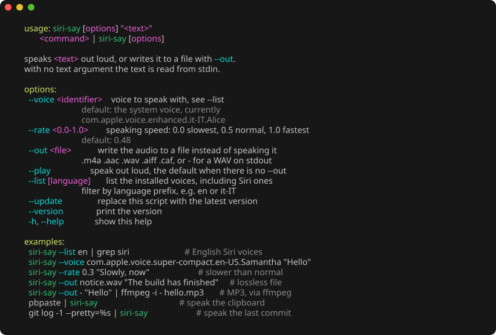

# `siri-say "Hello there"`

https://github.com/user-attachments/assets/fb8262ba-a614-4ca2-be22-42a8f6e3e9e6

> 🔊 **Unmute the player:** GitHub starts videos/audios muted.

Speak text from the command line with any voice installed on macOS, **including the
Siri voices**, either out loud or straight to an audio file. The built-in `say`
command cannot use the Siri voices; `siri-say` can.



## Install

Needs macOS with the Xcode command line tools (`xcode-select --install`). Nothing
else: no packages, no runtime, no network access.

```bash
/bin/bash -c "$(curl -fsSL https://raw.githubusercontent.com/marcomontalbano/siri-say/main/install.sh)"
```

The installer checks that you are on macOS with the Swift toolchain available,
downloads the script into the first writable of `/usr/local/bin`,
`/opt/homebrew/bin` or `~/.local/bin`, makes it executable, and tells you if that
directory is not on your `PATH`. Override with `SIRI_SAY_PREFIX=~/bin`, or pin a
release with `SIRI_SAY_REF=v0.1.0`.

Update later with `siri-say --update`, which downloads the same file over the
installed one and reports the version change. `SIRI_SAY_REF` works there too, so
`SIRI_SAY_REF=v0.1.0 siri-say --update` pins or rolls back.

siri-say is a single `#!/usr/bin/env swift` script and writes nothing else, so
uninstalling is `rm` on one file.

## Usage

```bash
siri-say --help
```

| option | meaning |
|---|---|
| `--list [prefix]` | list voices as `language  identifier  name (quality)`, Siri voices marked `[siri]`. Filter by language prefix, e.g. `--list en`. |
| `--voice <id>` | voice **identifier** from `--list`. Display names such as `"Voce 2"` do not resolve. Defaults to the system voice, the one set in System Settings > Accessibility > Spoken Content for your current language. |
| `--rate <0.0-1.0>` | speech rate. Default `0.48`, slightly under the system default. |
| `--out <file>` | write to a file instead of speaking; `-` writes a WAV to stdout. |
| `--play` | speak out loud, which is the default when `--out` is absent. |
| `--help` | usage and examples. |
| `--version` | print the version. |
| `--update` | replace the installed script with the latest published version. |

With no text argument the text is read from **stdin**, so `siri-say` composes with
other commands. Stdin is only consulted when it is piped or redirected; a bare
invocation on a terminal prints the usage rather than blocking.

### Output formats

The format follows the file extension:

| extension | format | ~2 s sample |
|---|---|---|
| `.m4a`, `.aac` | AAC, 128 kbps | 91 KB |
| `.wav` | 16-bit PCM | 189 KB |
| `.aiff`, `.aif` | 16-bit PCM, big-endian | 189 KB |
| `.caf` | Core Audio Format, the synthesiser's own lossless 32-bit float | 374 KB |
| `-` | WAV on stdout | n/a |

**`.mp3` is not supported.** macOS provides an MP3 decoder but no encoder, and `siri-say` has no
external dependencies. Pipe through ffmpeg if you need MP3:

```bash
siri-say --out - "Hello there" | ffmpeg -i - hello.mp3
```

### Examples

```bash
siri-say --list en | grep siri                         # English Siri voices
siri-say --voice com.apple.voice.super-compact.en-US.Samantha "Hello"
siri-say --rate 0.3 "Slowly, now"                      # slower than normal
siri-say --out notice.wav "The build has finished"     # lossless file
siri-say --out - "Hello" | ffmpeg -i - hello.mp3       # MP3, via ffmpeg
pbpaste | siri-say                                     # speak the clipboard
git log -1 --pretty=%s | siri-say                      # speak the last commit
```

## How it works

macOS ships high-quality neural Siri voices, but the built-in `say` command cannot
use them: they are absent from `say -v '?'` and cannot be selected by name. They are
not hidden from the framework, though. `AVSpeechSynthesisVoice.speechVoices()`
returns them alongside the classic voices, and `siri-say --list` marks them `[siri]`:

```bash
siri-say --list en | grep siri
# en-US  com.apple.siri.natural.<name>  Voice 1 (enhanced)  [siri]
```

Siri voice identifiers always start with `com.apple.siri.`; the exact names
differ per system and locale, so list yours rather than copying an identifier from
here.

`siri-say` goes through `AVSpeechSynthesizer` directly, so every installed voice is
available, and it can write the result to a file instead of only playing it.

Which Siri voices you have depends on your system language and on what is installed
under **System Settings → Accessibility → Spoken Content → System Voice → Manage
Voices**. Run `siri-say --list` to see what is on your machine.

### Why it runs interpreted

**The Siri voices are only exposed to Apple-signed processes.** Running the source
through `swift` works because the host process is Apple's own `swift-frontend`. The
identical code compiled with `swift build` receives a filtered voice list, and
`--voice com.apple.siri.natural.<name>` fails with *voice not found*.

Signing does not work around it: an ad-hoc signature and a full `.app` bundle with an
`Info.plist` both still get the filtered list, and the entitlement involved is
Apple-private and cannot be self-granted.

A compiled build is therefore fine for the classic voices, but only the shebang
script reaches the Siri ones, which is why that single file is what gets installed.

## Development

```bash
git clone https://github.com/marcomontalbano/siri-say.git
cd siri-say
./Sources/siri-say/main.swift --list
```

The source file is executable on its own, with no wrapper and nothing to build.
Symlink it onto your `PATH` to run it as `siri-say` while you work on it:

```bash
ln -s "$PWD/Sources/siri-say/main.swift" /usr/local/bin/siri-say
```

`swift build -c release` also works and produces `.build/release/siri-say`, which is
useful as a type-check, though that binary cannot use the Siri voices for the reason
in [Why it runs interpreted](#why-it-runs-interpreted).

### Exit status

`siri-say` exits `0` on success, `1` on a runtime error (unknown voice, no audio,
unsupported format, empty input), and `2` on invalid arguments.
